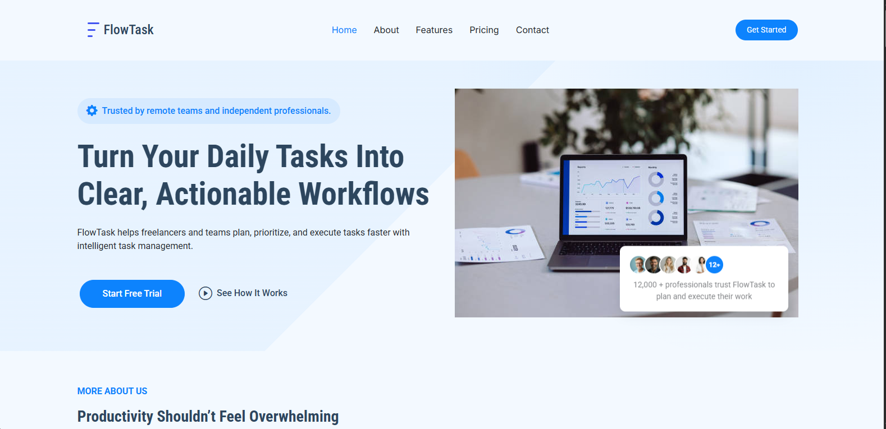
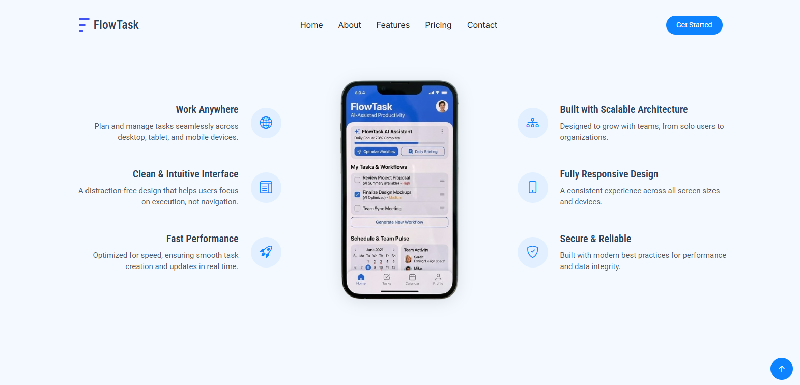
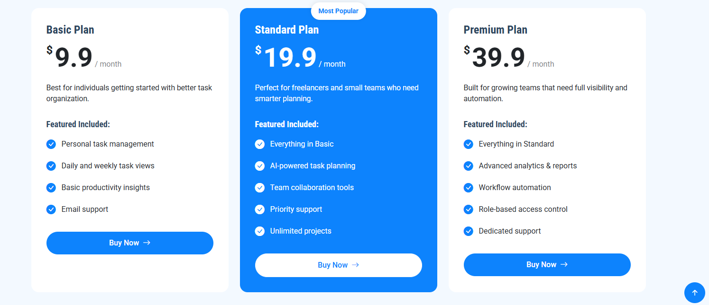

🚀 FlowTask – SaaS Productivity Landing Page

FlowTask is a modern SaaS landing page built to showcase productivity and workflow management application.

📌 Project Overview

FlowTask is designed to communicate how task management application helps users:

Organize daily tasks

Set clear priorities

Collaborate with teams

Track progress efficiently

Turn scattered work into structured workflows

The landing page reflects how a real SaaS product would be presented to potential users and investors.

## 📸 Project Screenshots

### Homepage

### Features

### Pricing

📬 Contact

If you'd like to collaborate or discuss this project:

Email: aulemercy@gmail.com.com

Portfolio: I will add later

LinkedIn: I will add later

📝 Note
This landing page is a portfolio demonstration project. Testimonials, statistics, and product data are presented for design purposes only.